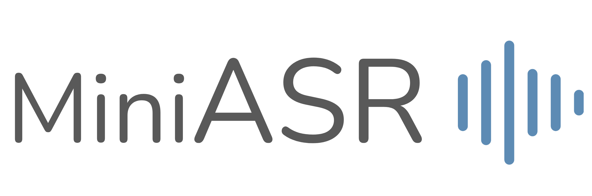

# MiniASR

A mini, simple, and fast end-to-end automatic speech recognition toolkit.

<p align="center">
  
  <br/>
  
</p>

## Intro

### Why Mini?
<!-- * **Minimal Code** 📄  
  Less than 1600 lines of code.
* **Minimal Modification** ✏️  
  Easy to customize. -->
* **Minimal Training** ⏱  
  Self-supervised pre-trained models + minimal fine-tuning.
* **Simple and Flexible** ⚙️  
  Easy to understand and customize.
* **Colab Compatible** 🧪  
  Train your model directly on Google Colab.
<!-- * **Fast Deployment** 🚀
  Fast fine-tuning for real-world applications. -->


### ASR Pipeline

* Preprocessing (`run_preprocess.py`)
  * Find all audio files and transcriptions.
  * Generate vocabularies (character/word/subword/code-switched).
* Training (`run_asr.py`)
  * Dataset (`miniasr/data/dataset.py`)
    * Tokenizer for text data (`miniasr/data/text.py`)
  * DataLoader (`miniasr/data/dataloader.py`)
  * Model (`miniasr/model/base_asr.py`)
    * Feature extractor
    * Data augmentation
    * End-to-end CTC ASR
* Testing (`run_asr.py`)
  * CTC greedy/beam decoding
  * Performance measures: error rates, RTF, latency


## Instructions

### Requirements
* Python 3.6+
* Install sox on your OS
* Install via pip:
```bash
pip install -e ./
```
Additional libraries:
* [fairseq](https://github.com/pytorch/fairseq): to use pre-trained feature extractors like wav2vec 2.0 or HuBERT.
* [flashlight](https://github.com/flashlight/flashlight): to decode with LM and beam search.


### Pre-trained ASR
You can directly use pre-trained ASR models for any applications. (under construction 🚧)
```python
from miniasr.utils import load_from_checkpoint
from miniasr.data.audio import load_waveform

# Option 1: Loading from a checkpoint
model, args, tokenizer = load_from_checkpoint('path/to/ckpt', 'cuda')
# Option 2: Loading from torch.hub (TODO)
model = torch.hub.load('vectominist/MiniASR', 'ctc_eng').to('cuda')

# Load waveforms and recognize!
waves = [load_waveform('path/to/waveform').to('cuda')]
hyps = model.recognize(waves)
```

### Preprocessing
* For already implemented corpora, please see `egs/`.
* To customize your own dataset, please see `miniasr/preprocess`.

<details><summary>miniasr-preprocess</summary><p>

Options:
```
  --corpus Corpus name.
  --path Path to dataset.
  --set Which subsets to be processed.
  --out Output directory.
  --gen-vocab Specify whether to generate vocabulary files.
  --char-vocab-size Character vocabulary size.
  --word-vocab-size Word vocabulary size.
  --subword-vocab-size Subword vocabulary size.
  --gen-subword Specify whether to generate subword vocabulary.
  --subword-mode {unigram,bpe} Subword training mode.
  --char-coverage Character coverage.
  --seed SEED Set random seed.
  --njobs Number of workers.
  --log-file Logging file.
  --log-level {DEBUG,INFO,WARNING,ERROR,CRITICAL} Logging level.
```

</p></details>

### Training & Testing
See examples in `egs/`.

<details><summary>miniasr-asr</summary><p>

Options:
```
  --config Training configuration file (.yaml).
  --test Specify testing mode.
  --ckpt Checkpoint for testing.
  --test-name Specify testing results' name.
  --cpu Using CPU only.
  --seed Set random seed.
  --njobs Number of workers.
  --log-file Logging file.
  --log-level {DEBUG,INFO,WARNING,ERROR,CRITICAL} Logging level.
```

</p></details>


<!-- ## Benchmark Corpora Support
See `egs/`.

### LibriSpeech
| Data | Extractor      | Model | Param    | Decode | test-clean | test-other |
| ---- | -------------- | ----- | -------- | ------ | ---------- | ---------- |
| 100h | fbank          | BLSTM | 40M      | Greedy |            |            |
| 100h | hubert (fixed) | BLSTM | 95 + 40M | Greedy | 6.4        | 15.1       |
| 100h | hubert (fixed) | BLSTM | 95 + 40M | LM     | 4.1        | 9.9        | -->

## TODO List
* Google Colab support
* `torch.hub` support
* Releasing pre-trained ASR models

<!-- ## Acknowledgements

TBA -->

## Reference Papers

* [Connectionist Temporal Classification: Labelling Unsegmented Sequence Data with Recurrent Neural Networks](https://www.cs.toronto.edu/~graves/icml_2006.pdf), Graves et al.
* [Neural Machine Translation of Rare Words with Subword Units](https://aclanthology.org/P16-1162/), Sennrich et al.
* [HuBERT: Self-Supervised Speech Representation Learning by Masked Prediction of Hidden Units](https://arxiv.org/abs/2106.07447), Hsu et al.
* [SpecAugment: A Simple Data Augmentation Method for Automatic Speech Recognition](https://arxiv.org/abs/1904.08779), Park et al.


## Reference Repos

* [PyTorch](https://github.com/pytorch/pytorch)
* [PyTorch Lightning](https://github.com/PyTorchLightning/pytorch-lightning)
* [S3PRL](https://github.com/s3prl/s3prl)
* [Fairseq](https://github.com/pytorch/fairseq)
* [Flashlight](https://github.com/flashlight/flashlight)
* [SentencePiece](https://github.com/google/sentencepiece)
* [End-to-end-ASR-Pytorch](https://github.com/Alexander-H-Liu/End-to-end-ASR-Pytorch)


## Citation

```
@misc{chang2021miniasr,
  title={{MiniASR}},
  author={Chang, Heng-Jui},
  year={2021},
  url={https://github.com/vectominist/MiniASR}
}
```
